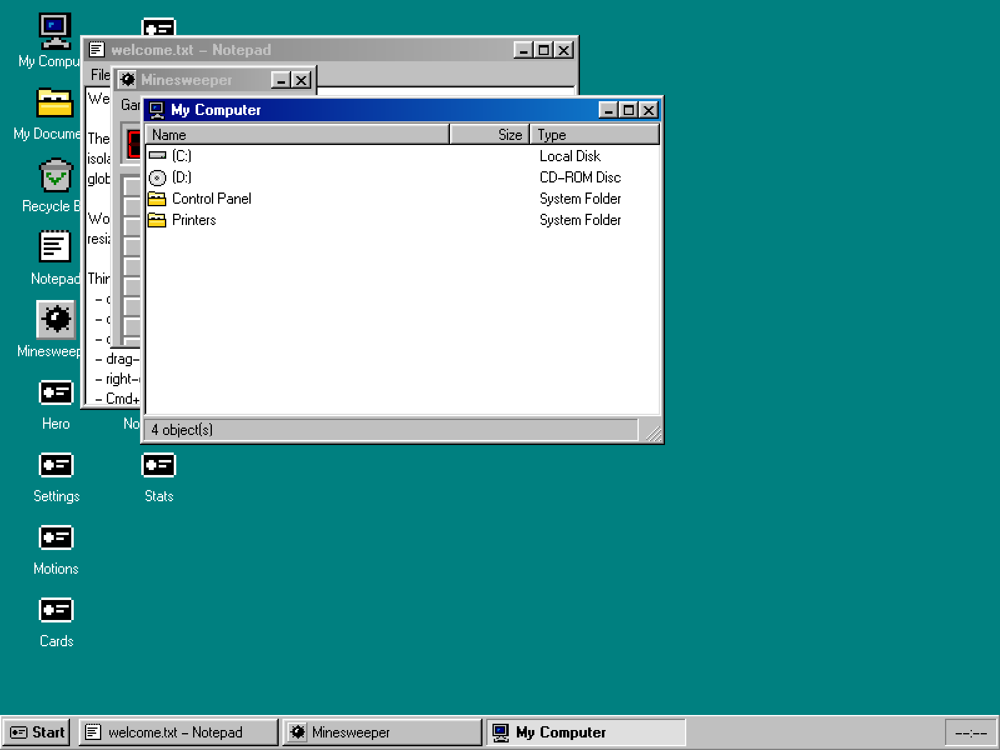
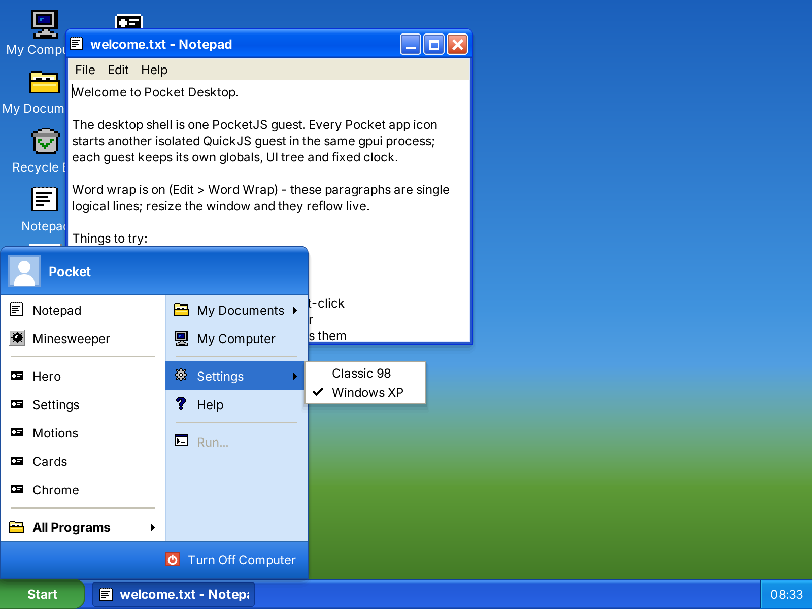

# Pocket Desktop

Pocket Desktop is a Pocket System product that runs multiple isolated Pocket
applications inside one native process. Its System UI owns windows, taskbar,
application presentation and theme selection; PocketJS owns package
resolution, AppInstance isolation, scheduling and native composition.

The `classic` theme is inspired by late-1990s desktop interfaces. The `xp`
theme draws Luna chrome with PocketJS-native drawing: every raised
surface is a three-stop base gradient under stacked 1px highlight and seat
strips, window frames round their top corners and stay square at the bottom,
and captions, controls, menus and the taskbar carry colors sampled from a
96dpi Luna capture. Its Start button opens the two-column XP panel — user
header, programs column with All Programs pinned at its foot, places column,
Turn Off Computer along the bottom — and its text is baked from Inter, since
XP's own Tahoma cannot be redistributed. **Both themes use the same System
manifest, AppInstances and native compositor.**
Choose one from **Start → Settings**, or press **Cmd+Shift+T** to toggle while
testing.

| Classic 98 | Windows XP |
|---|---|
|  |  |

## Architecture

```text
pocket.system.json
  ├─ roles.systemUI → dev.pocket-stack.desktop.system-ui
  ├─ installation snapshot
  └─ installed Pocket app catalog
             ↓
      ResolvedSystemPlan
             ↓
  PocketJS generic native desktop host
      ├─ System UI AppInstance
      ├─ AppSupervisor
      └─ native compositor surfaces
```

The System UI is in `src/system-ui`. Demo applications are consumed from the
pinned `vendor/pocketjs` submodule and are not copied into this product.

## Build

Requirements: Bun and Rust. macOS native builds also need Xcode command-line
tools. Linux native builds need the gpui X11/Wayland, Fontconfig and Vulkan
development libraries listed by the CI workflow.

```sh
bun run setup
bun run check
bun run build
bun run macos
```

On Linux, build and launch the same resolved Pocket System through the generic
gpui AppSupervisor host:

```sh
bun run linux
bun run package:linux
```

`package:linux` creates a relocatable `PocketDesktop` product directory and a
`pocket-desktop-linux-<arch>.tar.gz` distribution. After installing the Linux
libraries listed above, extract it and run:

```sh
./PocketDesktop/bin/pocket-desktop
```

The relocatable launcher sets the artifact root and passes the complete
`ResolvedSystemPlan` to the native host.

Build or serve the browser preview with:

```sh
bun run build:web
bun run web
bun run test:web
```

The browser host runs every installed package in an independent iframe
JavaScript Realm with its own wasm UI instance. The parent AppSupervisor
schedules focused/visible AppInstances and composites child rasters at the
shell's `CompositorSurface` painter positions. `test:web` drives a real
headless Chrome double-click journey and requires the Hero child raster to
replace its shell fallback before saving `dist/web-smoke.png`.

Build and verify the product site, including the complete preview at `/play/`,
with:

```sh
bun run build:site
bun run test:site
```

The production site is deployed as Cloudflare Workers Static Assets at
`desktop.pocketlab.build`. The checked-in Wrangler configuration owns its
custom-domain route; `bun run deploy:site` builds before publishing.

Regenerate both checked-in theme screenshots from the deterministic PocketJS
simulator with `bun run capture`.

## Classic baseline benchmark

Build the macOS release host, keep the desktop session unlocked and run:

```sh
bun run build
bun run benchmark:classic
```

The benchmark records the native executable and complete installed System
artifact sizes, ten process-cold/cache-warm launches from spawn to the first
painted frame, and settled idle process-tree RSS plus macOS physical footprint.
It writes the raw samples, machine identity, source revisions and a Markdown
summary to `docs/bench/classic-<date>.{json,md}`. Use `--quick` for a three-run
smoke check; quick results cannot replace the checked-in baseline.

Pass native-host script flags after `--`, for example:

```sh
bun run macos -- --quit-after 120
```

## Licensing

Pocket Desktop code and original assets are available under either:

1. **GNU GPL version 3 only** (`GPL-3.0-only`), whose complete terms are in
   `LICENSE`; or
2. **a separate commercial license** from the copyright holder, Yifeng
   "Evan" Wang, for distribution on different terms.

Choosing the commercial option requires a separately executed agreement; the
notice in `COMMERCIAL-LICENSE.md` is not itself a commercial license grant.
Third-party materials retain their own licenses as listed in `THIRD_PARTY.md`.

Contributions require the contributor license agreement in `CLA.md`. It lets
contributors retain copyright while granting the project the rights needed to
continue GPL distribution and commercial dual licensing.
